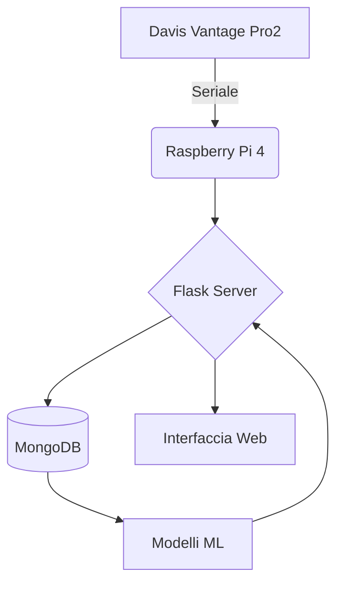

# 🌦️ Stazione Meteo - ITIS Mario Delpozzo
*Progetto didattico-pratico di meteorologia computazionale*


**Localizzazione:** Cuneo, Piemonte - Altitudine: 534 m s.l.m.

---

## 📌 Panoramica del Progetto

Sistema integrato per:
- ✅ **Raccolta dati meteorologici** in tempo reale
- ✅ **Analisi storica** con visualizzazioni avanzate
- ✅ **Previsioni a 3 giorni** tramite modelli ML
- ✅ **Automazione completa** dei processi

L'innovazione principale del progetto è l'implementazione di un sistema di intelligenza artificiale per la previsione del tempo. Utilizzando tecniche di regressione lineare, il nostro modello analizza i dati meteorologici storici forniti dall'ARPA Piemonte per la zona di Cuneo e identifica pattern e correlazioni che permettono di prevedere l'andamento delle condizioni meteorologiche per i tre giorni successivi.

Abbiamo utilizzato le conoscenze che abbiamo appreso durante gli anni scolastici per creare un prodotto originale e funzionale.
Inoltre abbiamo dovuto apprendere come utilizzare la stazione meteo Davis Vantage Pro2 (incontrando difficoltà per quando riguarda la decodifica del pacchetto LOOP), e abbiamo utilizzato un database non relazionale per espandere le nostre conoscenze in ambito informatico.

---

## 🛠️ Architettura del Sistema



---

## 💻 Tecnologie Principali

| Componente       | Tecnologia                                  |
|------------------|--------------------------------------------|
| **Frontend**     |   
   HTML5, Chart.js, Bootstrap                 |
| **Backend**      |     Python (Flask), PyMongo                    |
| **Machine Learning** |  Scikit-learn (Regressione Lineare) |
| **Database**     | MongoDB (NoSQL)                            |
| **Hardware**     | Davis Vantage Pro2 + Raspberry Pi 4        |

Abbiamo utilizzato le conoscenze che abbiamo appreso durante gli anni scolastici per creare un prodotto originale e funzionale.
Inoltre abbiamo dovuto apprendere come utilizzare la stazione meteo Davis Vantage Pro2 (incontrando difficoltà per quando riguarda la decodifica del pacchetto LOOP), e abbiamo utilizzato un database non relazionale per espandere le nostre conoscenze in ambito informatico.

---

## 📂 Struttura del Codice

```
app.py
README.md
assets/                   # dataset e notebook di analisi/previsione
│   ├── all_data.csv
│   ├── datasetPulito.csv
│   ├── datasetPulito_dd.csv
│   ├── datasetPulito_ddd.csv
│   ├── PrevisioniDomani.ipynb
│   ├── PrevisioniDopodomani.ipynb
│   └── PrevisioniDopodopodomani.ipynb
comunicazione/            # permette l'interazione tra il server e la stazione meteo
│   ├── conversione.py
│   ├── decode_LOOP.py
│   ├── richiesta_dati.py
│   └── __pycache__/
db/                       # permette l'interazione tra il server e il database
│   ├── gestioneDB.py
│   └── __pycache__/
docs/
│   ├── StazioneMeteoManuale_VantageSerialProtocolDocs_v261.pdf
│   └── user manual.pdf
machine_learning/         # permette di creare le previsioni meteorologiche
│   ├── gestione_ml_v1.py
│   ├── prova_emoji.py
│   ├── Modelli/
│   │   ├── PrecDom.pkl
│   │   ├── PrecDopDom.pkl
│   │   ├── PrecDopDopDom.pkl
│   │   ├── PressDom.pkl
│   │   ├── PressDopDom.pkl
│   │   ├── PressDopDopDom.pkl
│   │   ├── TempDom.pkl
│   │   ├── TempDopDom.pkl
│   │   ├── TempDopDopDom.pkl
│   │   ├── UmidDom.pkl
│   │   ├── UmidDopDom.pkl
│   │   ├── UmidDopDopDom.pkl
│   │   ├── VentoMedDom.pkl
│   │   ├── VentoMedDopDom.pkl
│   │   ├── VentoMedDopDopDom.pkl
│   │   ├── VentoRaffDom.pkl
│   │   ├── VentoRaffDopDom.pkl
│   │   └── VentoRaffDopDopDom.pkl
│   └── __pycache__/
static/                   # contiene le immagini presenti all'interno della web application
│   └── images/
│       ├── logo_itis.png
│       └── stazione.gif
templates/                # contiene le pagine della web application
│   ├── archivio-dati.html
│   ├── dati_live.html
│   ├── index.html
│   └── progetto.html
```

---

## 🔍 Funzionalità Dettagliate

### 1. Interfaccia Web (Flask)
L’interfaccia web, realizzata con Flask e template HTML, permette di monitorare e consultare i dati meteorologici in modo semplice e intuitivo. Le principali pagine sono:

- **Dashboard in tempo reale** (`index.html`):
  - Visualizza i dati meteo attuali (temperatura, umidità, vento, pressione, precipitazioni, punto di rugiada, temperatura percepita).
  - Mostra indicatori di stato della stazione (online/offline).
  - Presenta le previsioni meteo per domani, dopodomani e tra tre giorni, generate dai modelli di machine learning.
  - Utilizza grafici interattivi (Chart.js) per la visualizzazione delle serie temporali.
  - Evidenzia i valori estremi giornalieri (min/max temperatura, raffica di vento).

- **Archivio dati** (`archivio-dati.html`):
  - Tabella consultabile con tutti i dati storici raccolti.
  - Possibilità di scaricare i dataset in formato CSV o Excel.
  - Filtri temporali per selezionare intervalli di date di interesse.

- **Pagina progetto** (`progetto.html`):
  - Descrizione dettagliata del progetto, degli obiettivi e delle tecnologie utilizzate.
  - Spiegazione della pipeline di machine learning e delle automazioni implementate.

- **Dati live** (`dati_live.html`):
  - Visualizzazione aggiornata in tempo reale dei dati provenienti dalla stazione.
  - Aggiornamento automatico tramite chiamate API.

**Funzionalità aggiuntive:**
- Navigazione semplice tra le varie sezioni tramite barra di navigazione.
- Visualizzazione di alert e messaggi di stato per eventuali errori o disconnessioni della stazione.
- Interfaccia responsive, ottimizzata anche per dispositivi mobili.

### 2. Interazione tramite seriale
Una delle parti più complicate dell'intero progetto è stata l'interazione con la stazione meteorologica Davis Vantage Pro2. Il nostro codice puòi ricevere dati dalla stazione meteo Davis Vantage Pro2 attraverso la seriale. Mediante il WeatherLink USB Data Logger della Davis è possibile far comunicare la stazione meteo con il computer attraverso la seriale usb. Viste le grandi difficoltà incontrate nella decodifica dei pacchetti LOOP inviati dalla stazione abbiamo realizzato il modulo software con l'uso dell'intelligenza artificiale generativa (Claude) a partire dalla specifica tecnica del protocollo di comunicazione. Il pacchetto LOOP contiene tutti i dati provenienti dalla stazione meteo e in tal modo abbiamo ottenuto un traduttore del pacchetto LOOP reperibile qui: `./comunicazione/decode_LOOP.py`

### 3. Machine Learning
E' possibile consultare l'addestramento dei modelli di machine learning nella cartella `assets/` e nei notebook presenti (`PrevisioniDomani.ipynb`, `PrevisioniDopodomani.ipynb`, `PrevisioniDopodopodomani.ipynb`).
- **Modelli implementati:**
  - Regressione lineare (pipeline) per l'implementazione di diversi modelli per la creazione delle previsioni meteorologiche:
    - PrecDom.pkl
    - PrecDopDom.pkl
    - PrecDopDopDom.pkl
    - PressDom.pkl
    - PressDopDom.pkl
    - PressDopDopDom.pkl
    - TempDom.pkl
    - TempDopDom.pkl
    - TempDopDopDom.pkl
    - UmidDom.pkl
    - UmidDopDom.pkl
    - UmidDopDopDom.pkl
    - VentoMedDom.pkl
    - VentoMedDopDom.pkl
    - VentoMedDopDopDom.pkl
    - VentoRaffDom.pkl
    - VentoRaffDopDom.pkl
    - VentoRaffDopDopDom.pkl

- **Output previsioni:**  
  - "pressione": valore previsto della pressione atmosferica  
  - "temperatura": temperatura prevista  
  - "umidità": umidità prevista  
  - "precipitazione": precipitazione prevista  
  - "velocità media": velocità media del vento prevista  
  - "velocità raffica": velocità della raffica di vento prevista

#### Pipeline di Machine Learning
La nostra pipeline di ML include quattro fasi principali:
1. **Raccolta Dati**: Acquisizione dati storici da ARPA (https://www.arpa.piemonte.it/) e dati in tempo reale dai nostri sensori
2. **Preprocessamento**: Pulizia, normalizzazione e preparazione dei dati per l'addestramento
3. **Addestramento**: Regressione lineare su dati storici per identificare pattern meteorologici
4. **Previsione**: Generazione di previsioni meteorologiche per i successivi tre giorni

### 4. Automazioni
- **Raccolta dati in tempo reale**: ogni minuto la stazione viene interrogata e i dati vengono salvati in memoria temporanea.
- **Salvataggio periodico**: ogni 30 minuti i dati raccolti vengono salvati in modo permanente nel database.
- **Script di mezzanotte**: ogni giorno a un orario programmato, il sistema:
  - Calcola le statistiche giornaliere (medie, minimi, massimi, precipitazioni, ecc.)
  - Esegue i modelli di machine learning per generare le previsioni meteo per i tre giorni successivi
  - Aggiorna le previsioni mostrate nell’interfaccia web
  - Tiene conto della stagione corrente per migliorare l’accuratezza delle previsioni

---

## 🌍 Open source & Citizen Science
Teniamo al fatto che il nostro progetto sia open source! Vogliamo dare l'opportunità alle persone di caricare i propri dati all'interno del database contattando un'API REST in modo tale che i dati siano in un formato specifico. Parliamo quindi di citizen science, in pratica pensiamo che sia importante estendere il più possibile la copertura e la telemetria delle informazioni meteorologiche, per questo motivo invitiamo le persone a realizzare/partecipare alla rete weather station! Il nostro progetto è infatti adattabile a diversi tipi di stazioni meteo, semplicemente cambiano il modulo software di comunicazione con la stazione.

**Nota sulla richiesta API:** nella richiesta, oltre ai dati che vanno inviati secondo un certo formato, è necessario inviare anche il grado di accuratezza di tutti i sensori, in modo tale che la stazione possa prendere i tuoi dati in considerazione per la creazione di previsioni meteorologiche.

### Dettagli della Richiesta API

Per contribuire con i propri dati, è necessario effettuare una richiesta **`POST`** all'endpoint: `https://api.stazione-meteo.itis-delpozzo.it/weather-data`.
La richiesta deve includere due header principali:

  * **`Content-Type`**: `application/json`
  * **`Authorization`**: `Bearer {{JWT_TOKEN}}` (un token API personale che deve essere tenuto al sicuro).

Il corpo della richiesta deve essere un oggetto JSON con la seguente struttura:

```json
{
  "timestamp": "2025-09-13T14:30:00Z",
  "location": {
    "latitude": 44.5675,
    "longitude": 7.4823,
    "altitude": 425
  },
  "data": {
    "temperature": {
      "value": 23.5,
      "accuracy": 95.0,
      "unit": "celsius"
    },
    "humidity": {
      "value": 68.2,
      "accuracy": 90.0,
      "unit": "percent"
    },
    "pressure": {
      "value": 1013.25,
      "accuracy": 98.5,
      "unit": "hPa"
    }
  },
  "sensor_info": {
    "model": "Davis Vantage Pro2",
    "firmware_version": "1.2.3"
  }
}
```

È importante notare che l'API ha un limite di 100 richieste per ora.

**Implementazioni future:** Implementazioni future: crediamo sia importante seguire il cambiamento, anche alla luce del cambiamento climatico, quindi proporremo una versione del programma in grado di auto ri-addestrarsi autonomamente ogni 6mesi/1anno in modo tale da dare previsioni meteorologiche accurate!

---

## ⚙️ Installazione & Configurazione

1. **Prerequisiti**  
   Utilizzeremo un Raspberry PI4 come server del nostro progetto, su cui sarà installato il sistema operativo Raspberry Pi OS con una versione di python già installata (v 3.11.x per esempio)

2. **Installazione delle librerie**
```bash
pip install flask pymongo scikit-learn pandas
sudo apt-get install mongodb-server
```

3. **Avvio**  
  bisognerà prima di tutto capire su quale porta USB del computer è collegata la stazione meteo e poi modificare il codice di porta in `./comunicazione/richiesta_dati.py` 
```bash
python app.py  # Avvia server Flask su http://localhost
```

4. **Accesso all'interfaccia**  
   - Dashboard: `http://localhost/progetto`  
   - Archivio: `http://localhost/archivio-dati`  
   - Index: `http://localhost`  
   - Dati in tempo reale: `http://localhost/dati_live`  

---

## 🖼️ Screenshot dell'Interfaccia

### Dashboard in Tempo Reale

*La dashboard mostra condizioni meteo attuali con temperatura, umidità, vento, pressione e precipitazioni*

### Sistema di Previsione con Machine Learning

*Visualizzazione della pipeline di machine learning per le previsioni meteorologiche*

---

## 👨‍🏫 Team di Sviluppo
*Studenti ITIS Mario Delpozzo*:
- Eugenio Armando - https://github.com/itisAE
- Simone Giannasi - https://github.com/simoneGiannasi
- Nicolò Dutto - https://github.com/niconico11
- Rebecca Simondi - https://github.com/sbeb4

*Supervisione*:
- Simone Conradi - https://github.com/profConradi
- Roberta Molinari
