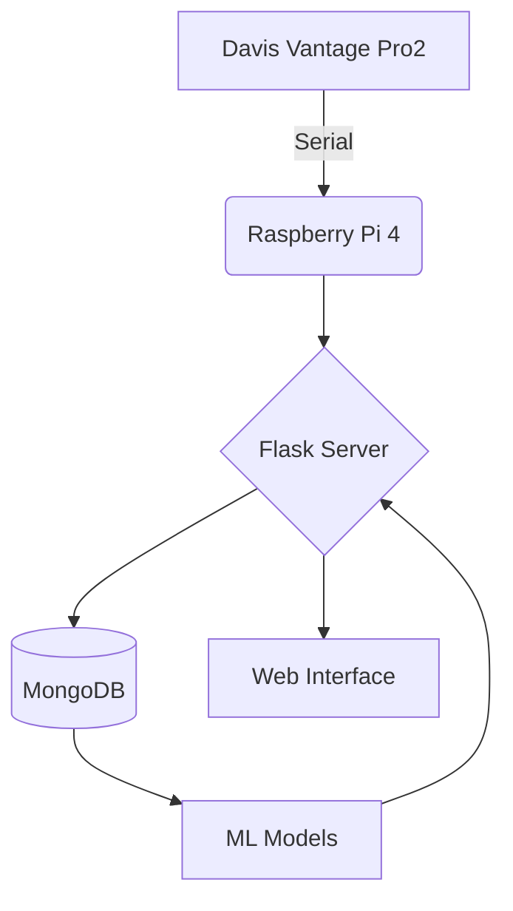

# 🌦️ Weather Station - ITIS Mario Delpozzo
*Educational-practical project in computational meteorology*


**Location:** Cuneo, Piedmont - Altitude: 534 m a.s.l.

---

## 📌 Project Overview

Integrated system for:
- ✅ **Real-time weather data collection**
- ✅ **Historical analysis** with advanced visualizations
- ✅ **3-day forecasts** using ML models
- ✅ **Complete automation** of processes

The main innovation of the project is the implementation of an artificial intelligence system for weather forecasting. Using linear regression techniques, our model analyzes historical weather data provided by ARPA Piemonte for the Cuneo area and identifies patterns and correlations that allow predicting weather conditions for the next three days.

We used the knowledge we learned during our school years to create an original and functional product.
Additionally, we had to learn how to use the Davis Vantage Pro2 weather station (encountering difficulties in decoding the LOOP packet), and we used a non-relational database to expand our knowledge in the IT field.

---

## 🛠️ System Architecture



---

## 💻 Main Technologies

| Component       | Technology                                  |
|------------------|--------------------------------------------|
| **Frontend**     |       |
| **Backend**      |     |
| **Machine Learning** |  |
| **Database**     |  |
| **Hardware**     | Davis Vantage Pro2 + Raspberry Pi 4        |

We used the knowledge we learned during our school years to create an original and functional product.
Additionally, we had to learn how to use the Davis Vantage Pro2 weather station (encountering difficulties in decoding the LOOP packet), and we used a non-relational database to expand our knowledge in the IT field.

# The Davis Vantage PRO2 Station
The Davis Vantage Pro2 is a professional-grade weather station that constitutes the hardware core of the project. It is known for its reliability and precision, providing real-time data that is then used for analysis and forecasts. The station is not limited to a single sensor, but is an integrated system that detects various environmental variables.

The Davis Vantage Pro2 station provides the following data:
- Temperature: Precise measurements of ambient temperature.
- Humidity: Detection of the degree of humidity in the air.
- Pressure: Measurement of atmospheric pressure (derived from the Console).
- Wind: Data on wind speed and direction.
- Precipitation: Detection of rainfall amounts.

---

## 📂 Code Structure

```
app.py
README.md
assets/                   # datasets and analysis/forecast notebooks
│   ├── all_data.csv
│   ├── datasetPulito.csv
│   ├── datasetPulito_dd.csv
│   ├── datasetPulito_ddd.csv
│   ├── PrevisioniDomani.ipynb
│   ├── PrevisioniDopodomani.ipynb
│   └── PrevisioniDopodopodomani.ipynb
comunicazione/            # enables interaction between server and weather station
│   ├── conversione.py
│   ├── decode_LOOP.py
│   ├── richiesta_dati.py
│   └── __pycache__/
db/                       # enables interaction between server and database
│   ├── gestioneDB.py
│   └── __pycache__/
docs/
│   ├── StazioneMeteoManuale_VantageSerialProtocolDocs_v261.pdf
│   └── user manual.pdf
machine_learning/         # enables weather forecast creation
│   ├── gestione_ml_v1.py
│   ├── prova_emoji.py
│   ├── Modelli/
│   │   ├── PrecDom.pkl
│   │   ├── PrecDopDom.pkl
│   │   ├── PrecDopDopDom.pkl
│   │   ├── PressDom.pkl
│   │   ├── PressDopDom.pkl
│   │   ├── PressDopDopDom.pkl
│   │   ├── TempDom.pkl
│   │   ├── TempDopDom.pkl
│   │   ├── TempDopDopDom.pkl
│   │   ├── UmidDom.pkl
│   │   ├── UmidDopDom.pkl
│   │   ├── UmidDopDopDom.pkl
│   │   ├── VentoMedDom.pkl
│   │   ├── VentoMedDopDom.pkl
│   │   ├── VentoMedDopDopDom.pkl
│   │   ├── VentoRaffDom.pkl
│   │   ├── VentoRaffDopDom.pkl
│   │   └── VentoRaffDopDopDom.pkl
│   └── __pycache__/
static/                   # contains images present within the web application
│   └── images/
│       ├── logo_itis.png
│       └── stazione.gif
templates/                # contains web application pages
│   ├── archivio_dati.html
│   ├── dati_live.html
│   ├── index.html
│   ├── csp.html
│   └── progetto.html
```

---

## 🔍 Detailed Features

### 1. Web Interface (Flask)
The web interface, built with Flask and HTML templates, allows monitoring and consulting weather data in a simple and intuitive way. The main pages are:

- **Real-time Dashboard** (`index.html`):
  - Displays current weather data (temperature, humidity, wind, pressure, precipitation, dew point, perceived temperature).
  - Shows station status indicators (online/offline).
  - Presents weather forecasts for tomorrow, day after tomorrow, and in three days, generated by machine learning models.
  - Uses interactive charts (Chart.js) for time series visualization.
  - Highlights daily extreme values (min/max temperature, wind gust).

- **Data Archive** (`archivio_dati.html`):
  - Consultable table with all collected historical data.
  - Ability to download datasets in CSV or Excel format.
  - Temporal filters to select date ranges of interest.

- **Project Page** (`progetto.html`):
  - Detailed description of the project, objectives, and technologies used.
  - Explanation of the machine learning pipeline and implemented automations.

- **Live Data** (`dati_live.html`):
  - Real-time updated visualization of data from the station.
  - Automatic updates through API calls.

- **Citizen Science Platform** (`csp.html`):
  - API documentation with instructions, examples, and a guided token request system.
  - Interactive tools such as the Sensor Accuracy Calculator to standardize and validate user-contributed data.

**Additional Features:**
- Simple navigation between various sections via navigation bar.
- Display of alerts and status messages for any errors or station disconnections.
- Responsive interface, optimized for mobile devices as well.

### 2. Serial Interaction
One of the most complicated parts of the entire project was the interaction with the Davis Vantage Pro2 weather station. Our code can receive data from the Davis Vantage Pro2 weather station through serial communication. Through the Davis WeatherLink USB Data Logger, it's possible to make the weather station communicate with the computer through USB serial. Given the great difficulties encountered in decoding the LOOP packets sent by the station, we created the software module using generative artificial intelligence (Claude) starting from the technical specification of the communication protocol. The LOOP packet contains all data from the weather station, and thus we obtained a LOOP packet translator available here: `./comunicazione/decode_LOOP.py`

### 3. Machine Learning
You can view the training of machine learning models in the `assets/` folder and in the present notebooks (`PrevisioniDomani.ipynb`, `PrevisioniDopodomani.ipynb`, `PrevisioniDopodopodomani.ipynb`).
- **Implemented models:**
  - The listed files are dump files of post-training machine learning model instances. These models were created using Python's joblib library to implement a linear regression pipeline.

    - PrecDom.pkl
    - PrecDopDom.pkl
    - PrecDopDopDom.pkl
    - PressDom.pkl
    - PressDopDom.pkl
    - PressDopDopDom.pkl
    - TempDom.pkl
    - TempDopDom.pkl
    - TempDopDopDom.pkl
    - UmidDom.pkl
    - UmidDopDom.pkl
    - UmidDopDopDom.pkl
    - VentoMedDom.pkl
    - VentoMedDopDom.pkl
    - VentoMedDopDopDom.pkl
    - VentoRaffDom.pkl
    - VentoRaffDopDom.pkl
    - VentoRaffDopDopDom.pkl

- **Forecast output:**  
  - "pressure": predicted atmospheric pressure value  
  - "temperature": predicted temperature  
  - "humidity": predicted humidity  
  - "precipitation": predicted precipitation  
  - "average speed": predicted average wind speed  
  - "gust speed": predicted wind gust speed

#### Machine Learning Pipeline
Our ML pipeline includes four main phases:
1. **Data Collection**: Acquisition of historical data from ARPA (https://www.arpa.piemonte.it/) and real-time data from our sensors
2. **Preprocessing**: Cleaning, normalization, and data preparation for training
3. **Training**: Linear regression on historical data to identify weather patterns
4. **Prediction**: Generation of weather forecasts for the next three days

### 4. Automations
- **Real-time data collection**: every minute the station is queried and data is saved in temporary memory.
- **Periodic saving**: every 30 minutes collected data is permanently saved in the database.
- **Midnight script**: every day at a scheduled time, the system:
  - Calculates daily statistics (averages, minimums, maximums, precipitation, etc.)
  - Runs machine learning models to generate weather forecasts for the next three days
  - Updates forecasts shown in the web interface
  - Takes into account the current season to improve forecast accuracy

---

## 🌍 Open Source & Citizen Science
We care about our project being open source! We want to give people the opportunity to upload their own data to the database by contacting a REST API so that the data is in a specific format. We're therefore talking about citizen science; in practice, we think it's important to extend as much as possible the coverage and telemetry of weather information. For this reason, we invite people to create/participate in the weather station network! Our project is indeed adaptable to different types of weather stations; simply the software communication module with the station changes.

**Note on API request:** in the request, besides the data that must be sent in a certain format, it's necessary to also send the accuracy level of all sensors, so that the station can take your data into consideration for creating weather forecasts.

### API Request Details

To contribute with your own data, you need to request a token by making a request using your email address in the citizen science section of the site.  
Then make a **`POST`** request to the endpoint: `https://api.stazione-meteo.itis-delpozzo.it/weather-data`.
The request must include two main headers:

  * **`Content-Type`**: `application/json`
  * **`Authorization`**: `Bearer {{JWT_TOKEN}}` (a personal API token that must be kept secure).

The request body must be a JSON object with the following structure:

```json
{
  "timestamp": "2025-09-13T14:30:00Z",
  "location": {
    "latitude": 44.5675,
    "longitude": 7.4823,
    "altitude": 425
  },
  "data": {
    "temperature": {
      "value": 23.5,
      "accuracy": 95.0,
      "unit": "celsius"
    },
    "humidity": {
      "value": 68.2,
      "accuracy": 90.0,
      "unit": "percent"
    },
    "pressure": {
      "value": 1013.25,
      "accuracy": 98.5,
      "unit": "hPa"
    }
  },
  "sensor_info": {
    "model": "Davis Vantage Pro2",
    "firmware_version": "1.2.3"
  }
}
```

It's important to note that the API has a limit of 100 requests per hour.

**Future implementations:** We believe it's important to follow change, especially in light of climate change, so we will propose a version of the program capable of automatically re-training itself every 6 months/1 year to provide accurate weather forecasts!

---

## ⚙️ Installation & Configuration

1. **Prerequisites**  
   We will use a Raspberry PI4 as the server for our project, on which the Raspberry Pi OS operating system will be installed with a pre-installed version of Python (v 3.11.x for example)

2. **Library Installation**
```bash
pip install flask pymongo scikit-learn pandas
sudo apt-get install mongodb-server
```

3. **Startup**  
  You'll first need to understand which USB port of the computer the weather station is connected to and then modify the port code in `./comunicazione/richiesta_dati.py` 
```bash
python app.py  # Start Flask server on http://localhost
```

4. **Interface Access**  
   - Dashboard: `http://localhost/project`  
   - Archive: `http://localhost/data_archive`  
   - Index: `http://localhost`  
   - Real-time data: `http://localhost/live_data`  
   - Citizen science platform: `http://localhost/csp`  

---

## 🖼️ Interface Screenshots

### Real-Time Dashboard

*The dashboard shows current weather conditions with temperature, humidity, wind, pressure, and precipitation*

### Machine Learning Prediction System

*Visualization of the machine learning pipeline for weather forecasting*

---

## 👨‍🏫 Development Team
*ITIS Mario Delpozzo Students*:
- Eugenio Armando - https://github.com/itisAE
- Simone Giannasi - https://github.com/simoneGiannasi
- Nicolò Dutto - https://github.com/niconico11
- Rebecca Simondi - https://github.com/sbeb4

*Supervision*:
- Simone Conradi - https://github.com/profConradi
- Roberta Molinari