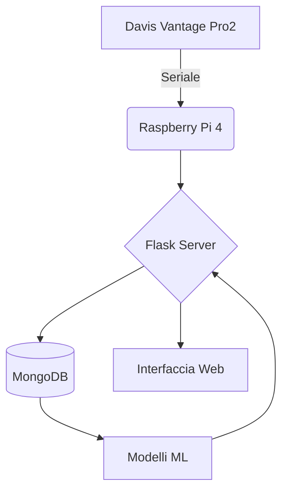

# **🌦️ Stazione Meteo - ITIS Mario Delpozzo**  
*(Progetto didattico-pratico di meteorologia computazionale)*  


*Il progetto è localizzato a Cuneo, Piemonte - Altitudine: 534 m s.l.m.*  

## **📌 Panoramica del Progetto**  
Sistema integrato per:  
✅ **Raccolta dati meteorologici** in tempo reale  
✅ **Analisi storica** con visualizzazioni avanzate  
✅ **Previsioni a 3 giorni** tramite modelli ML  
✅ **Automazione completa** dei processi  

L'innovazione principale del progetto è l'implementazione di un sistema di intelligenza artificiale per la previsione del tempo. Utilizzando tecniche di regressione lineare, il nostro modello analizza i dati meteorologici storici forniti dall'ARPA Piemonte per la zona di Cuneo e identifica pattern e correlazioni che permettono di prevedere l'andamento delle condizioni meteorologiche per i tre giorni successivi.  

---

## **🛠️ Architettura del Sistema**  


---

## **💻 Tecnologie Principali**  

| Componente       | Tecnologia                                  |
|------------------|--------------------------------------------|
| **Frontend**     | HTML5, Chart.js, Bootstrap                 |
| **Backend**      | Python (Flask), PyMongo                    |
| **Machine Learning** | Scikit-learn (Regressione Lineare, Random Forest) |
| **Database**     | MongoDB (NoSQL)                            |
| **Hardware**     | Davis Vantage Pro2 + Raspberry Pi 4        |

---

## **📂 Struttura del Codice**  

```
Stazione-meteo/
├── templates/
│   ├── progetto.html        # Dashboard principale
│   └── archivio-dati.html   # Visualizzazione dati storici
├── static/
│   ├── css/
│   └── js/                  # Script per grafici Chart.js
├── ml_model/
│   ├── gestione_ml_v1.py    # Addestramento modelli
│   └── modelli.pkl          # Modelli serializzati
├── database/
│   └── gestioneDB.py        # CRUD per MongoDB
└── app.py                   # Core Flask + automazioni
```

---

## **🔍 Funzionalità Dettagliate**  

### **1. Interfaccia Web (Flask)**  
- **Dashboard in tempo reale** con:  
  - Grafici interattivi (Chart.js)  
  - Indicatori meteo principali  
  - Mappe termiche  
- **Archivio dati** con:  
  - Download dataset (CSV/Excel)  
  - Filtri temporali  

### **2. Machine Learning**  
```python
# Esempio da gestione_ml_v1.py
model = LinearRegression()
model.fit(X_train, y_train)  # Addestrato su: temp, umidità, vento
joblib.dump(model, 'modelli.pkl')  # Serializzazione
```
- **Modelli implementati:**  
  - Regressione lineare (baseline)  
  - Random Forest (miglior accuratezza)  
- **Output previsioni:**  
  - Temperatura attesa (±0.5°C)  
  - Probabilità di precipitazioni  

#### **Pipeline di Machine Learning**
La nostra pipeline di ML include quattro fasi principali:
1. **Raccolta Dati**: Acquisizione dati storici da ARPA e dati in tempo reale dai nostri sensori
2. **Preprocessamento**: Pulizia, normalizzazione e preparazione dei dati per l'addestramento
3. **Addestramento**: Regressione lineare su dati storici per identificare pattern meteorologici
4. **Previsione**: Generazione di previsioni meteorologiche per i successivi tre giorni  

### **3. Automazione**  
- **Script mezzanotte** (in `app.py`):  
  ```python
  @scheduler.task('cron', id='calc_giornaliero', hour=0)
  def calcolo_medie():
      # Calcola medie giornaliere e salva su DB
  ```

---

## **⚙️ Installazione & Configurazione**  

1. **Prerequisiti**  
   ```bash
   pip install flask pymongo scikit-learn pandas
   sudo apt-get install mongodb-server
   ```

2. **Avvio**  
   ```bash
   python app.py  # Avvia server Flask su http://localhost:5000
   ```

3. **Accesso all'interfaccia**  
   - Dashboard: `/progetto`  
   - Archivio: `/archivio-dati`  

---

## **🖼️ Screenshot dell'Interfaccia**

### Dashboard in Tempo Reale

*La dashboard mostra condizioni meteo attuali con temperatura, umidità, vento, pressione e precipitazioni*

### Sistema di Previsione con Machine Learning

*Visualizzazione della pipeline di machine learning per le previsioni meteorologiche*

---

## **Repository di Sviluppo**
- [Repository di Simone Giannasi](https://github.com/simoneGiannasi/Stazione_Meteo)
- [Repository di Nicolò Dutto](https://github.com/niconico11/SEN-Meteo)  
- **IoT applicato alla meteorologia**  
- **Sviluppo full-stack** (frontend + backend)  
- **Machine Learning su serie temporali**  
- **Gestione database NoSQL**  

---


## **👨‍🏫 Team di Sviluppo**  
*Studenti ITIS Mario Delpozzo*:  
- [Eugenio Armando](https://github.com/itisAE)  
- [Nicolò Dutto](https://github.com/niconico11)  
- [Simone Giannasi](https://github.com/simoneGiannasi)  
- [Rebecca Simondi](https://github.com/sbeb4)  

*Supervisione*:  
- [Simone Conradi](https://github.com/profConradi)
- Roberta Molinari  

---
