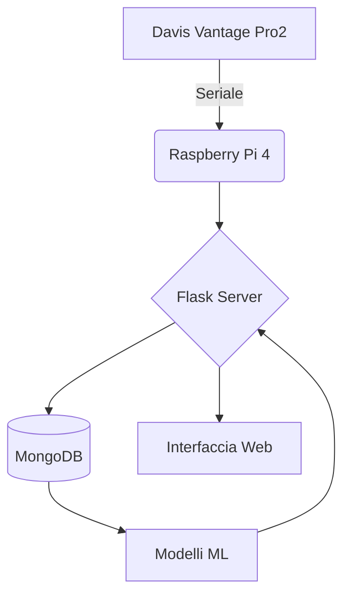

### 🌦️ Stazione Meteo - ITIS Mario Delpozzo

*Progetto didattico-pratico di meteorologia computazionale*

**Localizzazione:** Cuneo, Piemonte - Altitudine: 534 m s.l.m.

-----

## 📌 Panoramica del Progetto

Sistema integrato per:

  - ✅ **Raccolta dati meteorologici** in tempo reale
  - ✅ **Analisi storica** con visualizzazioni avanzate
  - ✅ **Previsioni a 3 giorni** tramite modelli ML
  - ✅ **Automazione completa** dei processi

L'innovazione principale del progetto è l'implementazione di un sistema di intelligenza artificiale per la previsione del tempo. Utilizzando tecniche di regressione lineare, il nostro modello analizza i dati meteorologici storici forniti dall'ARPA Piemonte per la zona di Cuneo e identifica pattern e correlazioni che permettono di prevedere l'andamento delle condizioni meteorologiche per i tre giorni successivi.

Abbiamo utilizzato le conoscenze che abbiamo appreso durante gli anni scolastici per creare un prodotto originale e funzionale.
Inoltre abbiamo dovuto apprendere come utilizzare la stazione meteo Davis Vantage Pro2 (incontrando difficoltà per quando riguarda la decodifica del pacchetto LOOP), e abbiamo utilizzato un database non relazionale per espandere le nostre conoscenze in ambito informatico.

**Apprendimenti (brevi note):**

  - Html5 -\> imparato con Bootstrap a Informatica
  - Python -\> imparato in TPSIT
  - PyMongo -\> autodidatti
  - Scikit-learn -\> Microrobotica
  - Davis Vantage Pro2 -\> autodidatti

-----

## 🛠️ Architettura del Sistema



-----

## 💻 Tecnologie Principali

| Componente       | Tecnologia                                  |
|------------------|--------------------------------------------|
| **Frontend**     | HTML5, Chart.js, Bootstrap                 |
| **Backend**      | Python (Flask), PyMongo                    |
| **Machine Learning** | Scikit-learn (Regressione Lineare) |
| **Database**     | MongoDB (NoSQL)                            |
| **Hardware**     | Davis Vantage Pro2 + Raspberry Pi 4        |

Abbiamo utilizzato le conoscenze che abbiamo appreso durante gli anni scolastici per creare un prodotto originale e funzionale. Inoltre abbiamo dovuto apprendere come utilizzare la stazione meteo Davis Vantage Pro2 (incontrando difficoltà per quando riguarda la decodifica del pacchetto LOOP), e abbiamo utilizzato un database non relazionale per espandere le nostre conoscenze in ambito informatico.

 -\> imparato in molteplici materie scolastiche
 -\> imparato a TPSIT
 -\> autodidatti
 -\> imparato a informatica
 -\> autodidatti
 -\> imparato a microrobotica
davisvantagepro2 -\> autodidatti

-----

## 📂 Struttura del Codice

```
app.py
README.md
assets/                   # dataset e notebook di analisi/previsione
│   ├── all_data.csv
│   ├── datasetPulito.csv
│   ├── datasetPulito_dd.csv
│   ├── datasetPulito_ddd.csv
│   ├── PrevisioniDomani.ipynb
│   ├── PrevisioniDopodomani.ipynb
│   └── PrevisioniDopodopodomani.ipynb
comunicazione/            # permette l'interazione tra il server e la stazione meteo
│   ├── conversione.py
│   ├── decode_LOOP.py
│   ├── richiesta_dati.py
│   └── __pycache__/
db/                       # permette l'interazione tra il server e il database
│   ├── gestioneDB.py
│   └── __pycache__/
docs/
│   ├── StazioneMeteoManuale_VantageSerialProtocolDocs_v261.pdf
│   └── user manual.pdf
machine_learning/         # permette di creare le previsioni meteorologiche
│   ├── gestione_ml_v1.py
│   ├── prova_emoji.py
│   ├── Modelli/
│   │   ├── PrecDom.pkl
│   │   ├── PrecDopDom.pkl
│   │   ├── PrecDopDopDom.pkl
│   │   ├── PressDom.pkl
│   │   ├── PressDopDom.pkl
│   │   ├── PressDopDopDom.pkl
│   │   ├── TempDom.pkl
│   │   ├── TempDopDom.pkl
│   │   ├── TempDopDopDom.pkl
│   │   ├── UmidDom.pkl
│   │   ├── UmidDopDom.pkl
│   │   ├── UmidDopDopDom.pkl
│   │   ├── VentoMedDom.pkl
│   │   ├── VentoMedDopDom.pkl
│   │   ├── VentoMedDopDopDom.pkl
│   │   ├── VentoRaffDom.pkl
│   │   ├── VentoRaffDopDom.pkl
│   │   └── VentoRaffDopDopDom.pkl
│   └── __pycache__/
static/                   # contiene le immagini presenti all'interno della web application
│   └── images/
│       ├── logo_itis.png
│       └── stazione.gif
templates/                # contiene le pagine della web application
│   ├── archivio-dati.html
│   ├── dati_live.html
│   ├── index.html
│   └── progetto.html
```

-----

## 🔍 Funzionalità Dettagliate

### 1\. Interfaccia Web (Flask)

L’interfaccia web, realizzata con Flask e template HTML, permette di monitorare e consultare i dati meteorologici in modo semplice e intuitivo. Le principali pagine sono:

  * **Dashboard in tempo reale** (`index.html`): Visualizza i dati meteo attuali e le previsioni a 3 giorni.
  * **Archivio dati** (`archivio-dati.html`): Tabella consultabile con tutti i dati storici raccolti.
  * **Pagina progetto** (`progetto.html`): Descrizione dettagliata del progetto e delle tecnologie utilizzate.
  * **Dati live** (`dati_live.html`): Visualizzazione aggiornata in tempo reale dei dati provenienti dalla stazione.

### 2\. Interazione tramite seriale

Una delle parti più complicate dell'intero progetto è stata l'interazione con la stazione meteorologica Davis Vantage Pro2. Il nostro codice può ricevere dati dalla stazione meteo Davis Vantage Pro2 attraverso la seriale. Mediante il WeatherLink USB Data Logger della Davis è possibile far comunicare la stazione meteo con il computer attraverso la seriale usb. Viste le grandi difficoltà incontrate nella decodifica dei pacchetti LOOP inviati dalla stazione abbiamo realizzato il modulo software con l'uso dell'intelligenza artificiale generativa (Claude) a partire dalla specifica tecnica del protocollo di comunicazione. Il pacchetto LOOP contiene tutti i dati provenienti dalla stazione meteo e in tal modo abbiamo ottenuto un traduttore del pacchetto LOOP reperibile qui: `./comunicazione/decode_LOOP.py`

### 3\. Machine Learning

È possibile consultare l'addestramento dei modelli di machine learning nella cartella `assets/` e nei notebook presenti (`PrevisioniDomani.ipynb`, `PrevisioniDopodomani.ipynb`, `PrevisioniDopodopodomani.ipynb`).

  * **Modelli implementati:**
      * Regressione lineare (pipeline) per l'implementazione di diversi modelli per la creazione delle previsioni meteorologiche:
      * PrecDom.pkl
      * PrecDopDom.pkl
      * PrecDopDopDom.pkl
      * PressDom.pkl
      * PressDopDom.pkl
      * PressDopDopDom.pkl
      * TempDom.pkl
      * TempDopDom.pkl
      * TempDopDopDom.pkl
      * UmidDom.pkl
      * UmidDopDom.pkl
      * UmidDopDopDom.pkl
      * VentoMedDom.pkl
      * VentoMedDopDom.pkl
      * VentoMedDopDopDom.pkl
      * VentoRaffDom.pkl
      * VentoRaffDopDom.pkl
      * VentoRaffDopDopDom.pkl

### 4\. Automazioni

  * **Raccolta dati in tempo reale**: ogni minuto la stazione viene interrogata e i dati vengono salvati in memoria temporanea.
  * **Salvataggio periodico**: ogni 30 minuti i dati raccolti vengono salvati in modo permanente nel database.
  * **Script di mezzanotte**: ogni giorno a un orario programmato, il sistema calcola le statistiche giornaliere, esegue i modelli di machine learning per generare le previsioni e aggiorna le previsioni nell’interfaccia web.

-----

## 🌍 Open source & Citizen Science

Teniamo al fatto che il nostro progetto sia open source\! Vogliamo dare l'opportunità alle persone di caricare i propri dati all'interno del database contattando un'**API REST** in modo tale che i dati siano in un formato specifico. Parliamo quindi di **citizen science**, in pratica pensiamo che sia importante estendere il più possibile la copertura e la telemetria delle informazioni meteorologiche, per questo motivo invitiamo le persone a realizzare/partecipare alla rete weather station\! Il nostro progetto è infatti adattabile a diversi tipi di stazioni meteo, semplicemente cambiando il modulo software di comunicazione con la stazione.

**Nota sulla richiesta API REST:** nella richiesta, oltre ai dati che vanno inviati secondo un certo formato, è necessario inviare anche il grado di accuratezza di tutti i sensori, in modo tale che la stazione possa prendere i tuoi dati in considerazione per la creazione di previsioni meteorologiche.

### Dettagli della Richiesta API

Per contribuire con i propri dati, è necessario effettuare una richiesta **`POST`** all'endpoint: `https://api.stazione-meteo.itis-delpozzo.it/weather-data`.
La richiesta deve includere due header principali:

  * **`Content-Type`**: `application/json`
  * **`Authorization`**: `Bearer {{JWT_TOKEN}}` (un token API personale che deve essere tenuto al sicuro).

Il corpo della richiesta deve essere un oggetto JSON con la seguente struttura:

```json
{
  "timestamp": "2025-09-13T14:30:00Z",
  "location": {
    "latitude": 44.5675,
    "longitude": 7.4823,
    "altitude": 425
  },
  "data": {
    "temperature": {
      "value": 23.5,
      "accuracy": 95.0,
      "unit": "celsius"
    },
    "humidity": {
      "value": 68.2,
      "accuracy": 90.0,
      "unit": "percent"
    },
    "pressure": {
      "value": 1013.25,
      "accuracy": 98.5,
      "unit": "hPa"
    }
  },
  "sensor_info": {
    "model": "Davis Vantage Pro2",
    "firmware_version": "1.2.3"
  }
}
```

È importante notare che l'API ha un limite di 100 richieste per ora.

**Implementazioni future:** crediamo sia importante seguire il cambiamento, anche alla luce del cambiamento climatico, quindi proporremo una versione del programma in grado di auto ri-addestrarsi autonomamente ogni 6mesi/1anno in modo tale da dare previsioni meteorologiche accurate\!

-----

## ⚙️ Installazione & Configurazione

1.  **Prerequisiti**  
    Si utilizzerà un Raspberry PI4 con Raspberry Pi OS e Python (v 3.11.x).

2.  **Installazione delle librerie**

<!-- end list -->

```bash
pip install flask pymongo scikit-learn pandas
sudo apt-get install mongodb-server
```

3.  **Avvio**  
    Bisognerà prima di tutto capire su quale porta USB del computer è collegata la stazione meteo e poi modificare il codice di porta in `./comunicazione/richiesta_dati.py`

<!-- end list -->

```bash
python app.py  # Avvia server Flask su http://localhost
```

4.  **Accesso all'interfaccia**  
      * Dashboard: `http://localhost/progetto`  
      * Archivio: `http://localhost/archivio-dati`  
      * Index: `http://localhost`  
      * Dati in tempo reale: `http://localhost/dati_live`  

-----

## 👨‍🏫 Team di Sviluppo

*Studenti ITIS Mario Delpozzo*:

  - Eugenio Armando - [https://github.com/itisAE](https://github.com/itisAE)
  - Simone Giannasi - [https://github.com/simoneGiannasi](https://github.com/simoneGiannasi)
  - Nicolò Dutto - [https://github.com/niconico11](https://github.com/niconico11)
  - Rebecca Simondi - [https://github.com/sbeb4](https://github.com/sbeb4)

*Supervisione*:

  - Simone Conradi - [https://github.com/profConradi](https://github.com/profConradi)
  - Roberta Molinari